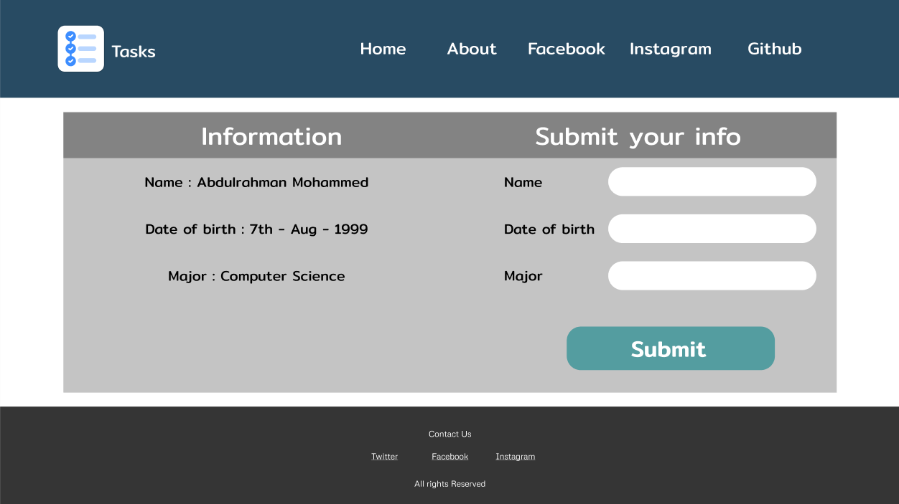
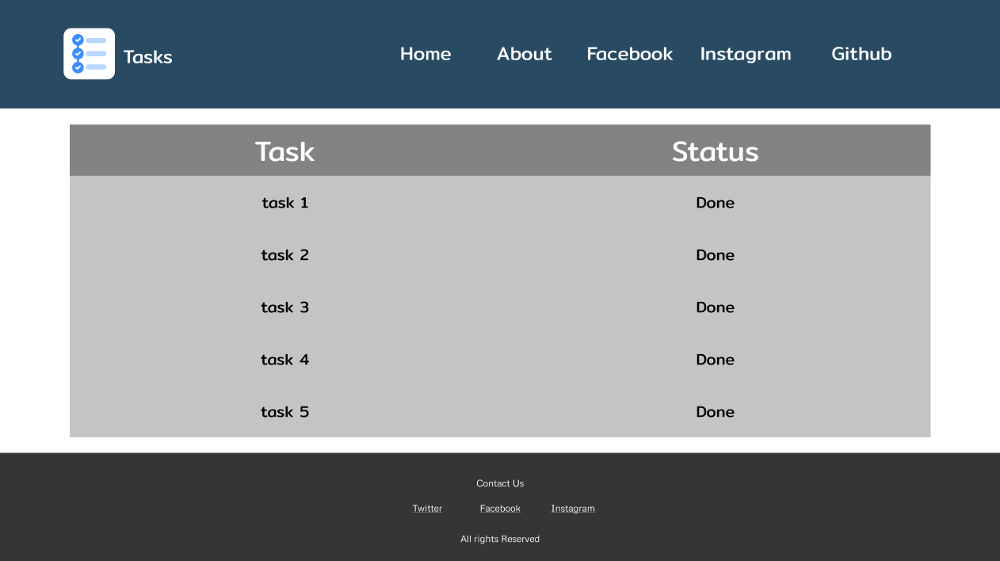

# todo-project

- i didnt fully understand how github works
- it took around 6 hours because i designed the wireframe and implemented it as a html & css and faced some problems pushing it to github and deploying the pages.
- i thought this task would take about 3 hours.
